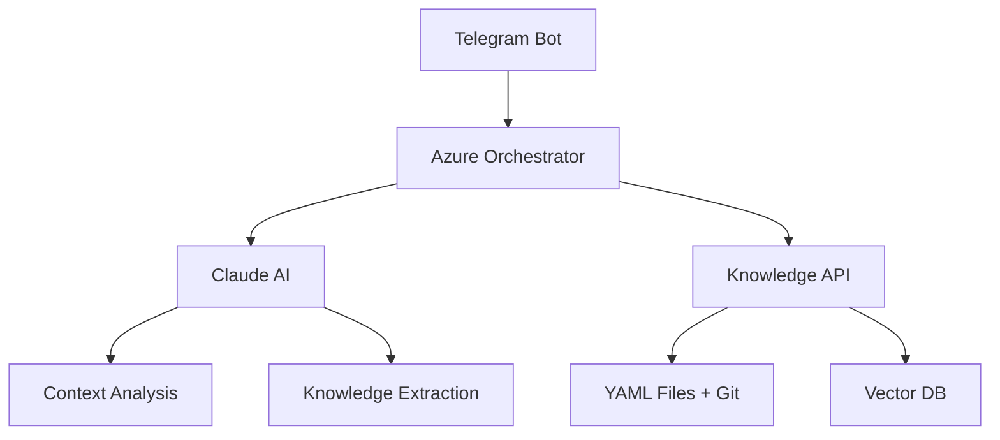

# Adaptive AI Assistant

> Универсальная AI-платформа для создания персональных ассистентов с автоматическим обучением из диалогов

[](https://github.com/yourusername/adaptive-ai-assistant)
[](LICENSE)

## 🎯 Что это такое

**Adaptive AI Assistant** — это платформа для создания умных ассистентов, которые:

- **Учатся из разговоров** — каждый диалог делает систему умнее
- **Автоматически обновляют знания** — предлагают сохранить важную информацию
- **Работают с любыми данными** — проекты, клиенты, задачи, процессы
- **Адаптируются под пользователя** — понимают контекст и предпочтения

**Проблема:** Корпоративные знания разбросаны по файлам, чатам, письмам. Поиск нужной информации занимает часы.

**Решение:** AI-ассистент который помнит всё, понимает контекст и отвечает на естественном языке.

## 🏗️ Архитектура



### Компоненты:

- **Telegram Bot** — интерфейс пользователя
- **Azure Orchestrator** — центральный координатор запросов
- **Claude AI** — анализ диалогов и генерация ответов
- **Knowledge API** — управление файлами и данными
- **YAML + Git** — структурированное хранение знаний
- **Vector DB** — семантический поиск (планируется)

## 🚀 Быстрый старт

### MVP версия (текущая разработка):

1. **Клонировать репозиторий:**
   ```bash
   git clone https://github.com/yourusername/adaptive-ai-assistant.git
   cd adaptive-ai-assistant
   ```

2. **Настроить переменные окружения:**
   ```bash
   cp .env.example .env
   # Добавить токены для Telegram Bot, Claude API, Azure
   ```

3. **Запустить локально:**
   ```bash
   # В разработке...
   ```

## 💡 Примеры использования

### Корпоративный ассистент:
```
👤 Пользователь: "Статус проекта Priority ERP?"
🤖 Ассистент: "Проект в срок, завершено 78% задач. Последнее обновление: интеграция API завершена вчера."

🤖 Ассистент: "Сохранить это обновление в базу знаний?"
👤 Пользователь: [✅ Да]
🤖 Ассистент: "✅ Обновлен файл projects.yaml"
```

### Управление встречами:
```
👤 Пользователь: "Что решили на планерке 5 августа?"
🤖 Ассистент: "Основные решения: отложить релиз на неделю, добавить тестирование API, назначить Алексея ответственным за интеграцию."
```

## 📁 Структура проекта

```
adaptive-ai-assistant/
├── docs/                    # Документация
├── src/
│   ├── telegram-bot/        # Telegram bot service
│   ├── azure-functions/     # Azure serverless functions
│   ├── knowledge-api/       # API для работы с знаниями
│   └── shared/              # Общие компоненты
├── knowledge-base/          # YAML файлы знаний
│   ├── projects.yaml
│   ├── meetings.yaml
│   └── clients.yaml
├── deployment/              # Docker, CI/CD
└── tests/
```

## 🛣️ Roadmap

### ✅ Phase 0: Планирование (текущая)
- [x] Архитектура и дизайн
- [x] Выбор технологического стека
- [ ] Настройка репозитория и CI/CD

### 🔄 Phase 1: MVP (2-3 недели)
- [ ] Telegram bot с базовым функционалом
- [ ] Azure Functions для обработки запросов
- [ ] Интеграция с Claude API
- [ ] Простой поиск по YAML файлам
- [ ] Базовое сохранение новых знаний

### 🔮 Phase 2: Intelligence (1-2 месяца)
- [ ] Vector database (Weaviate) для семантического поиска
- [ ] Автоматическое извлечение insights из диалогов
- [ ] Контекстуальные предложения по обновлению знаний
- [ ] Web интерфейс для управления базой знаний

### 🚀 Phase 3: Platform (3+ месяца)
- [ ] Поддержка множественных доменов
- [ ] API для интеграции с внешними системами
- [ ] Мульти-тенантность
- [ ] Enterprise features (безопасность, compliance)

## 🤝 Участие в проекте

Проект находится в стадии активной разработки. Приветствуются:

- 🐛 Баг-репорты и предложения улучшений
- 💡 Идеи новых функций
- 📖 Улучшения документации
- 🔧 Pull requests с исправлениями

## 📊 Метрики успеха

- **Время поиска информации:** с часов до минут
- **Качество ответов:** > 90% релевантных результатов
- **Рост знаний:** автоматическое пополнение базы на 20+ фактов в неделю
- **Удобство использования:** оценка пользователей > 8/10

## 📄 Лицензия

MIT License - подробности в файле [LICENSE](LICENSE)

## 📞 Контакты

- **Создатель:** [Ваше имя]
- **Email:** your.email@example.com
- **Telegram:** @yourusername

---

**Статус проекта:** 🟡 В активной разработке | Первая рабочая версия ожидается в сентябре 2025