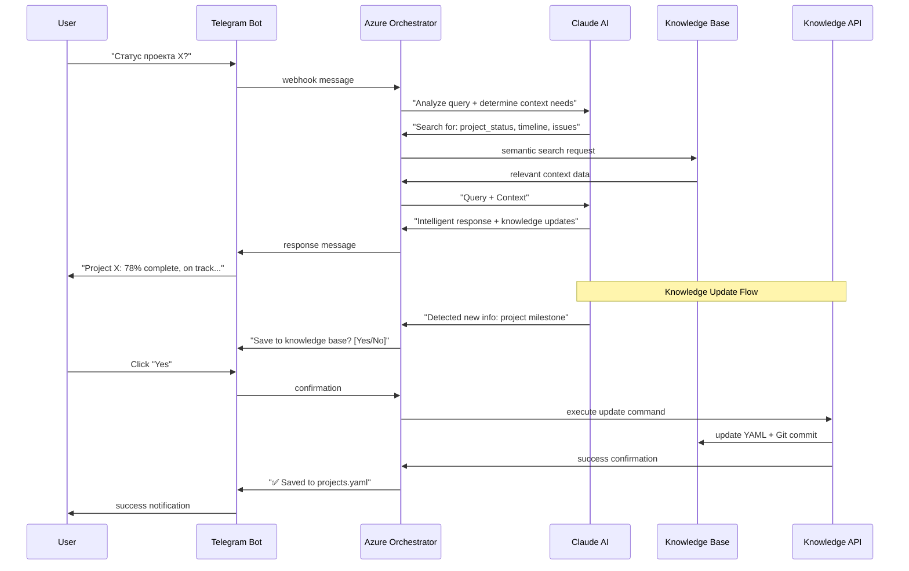
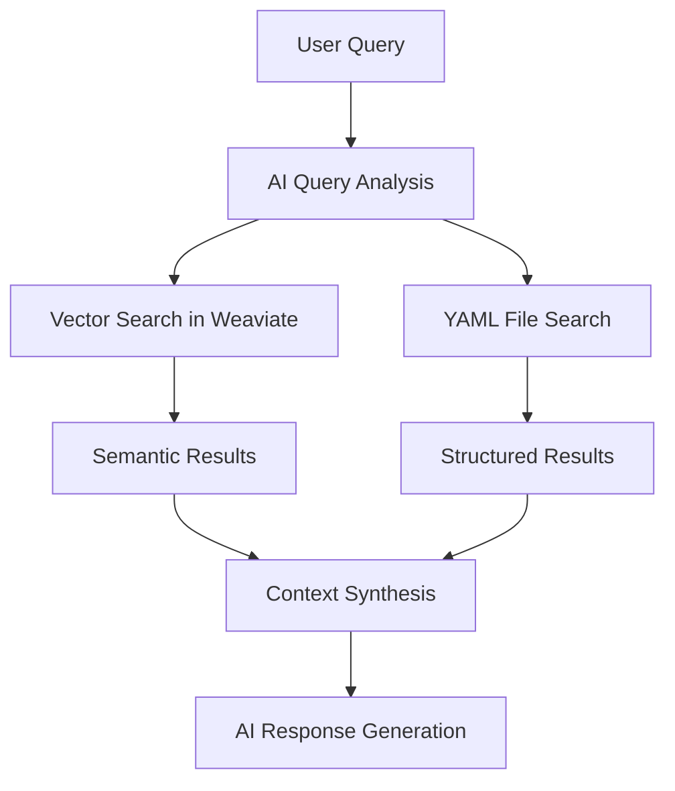
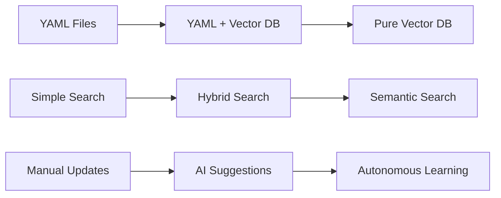

# Architecture Documentation

## 🏗️ System Overview

Adaptive AI Assistant использует микросервисную архитектуру с event-driven подходом для обработки диалогов и автоматического обновления знаний.

### Core Principles:
- **AI-First Decision Making** — все решения о структуре данных принимает AI
- **Incremental Learning** — система непрерывно обучается из диалогов
- **Domain Agnostic** — одна архитектура для любых бизнес-доменов
- **Human-in-the-Loop** — пользователь контролирует все обновления знаний

---

## 🔄 Data Flow Architecture



---

## 🧩 Component Architecture

### 1. **Telegram Bot Service**

**Technology:** Node.js + Telegraf framework
**Responsibilities:**
- Handle incoming messages and commands
- Display interactive buttons and forms
- Send notifications and responses
- File uploads and media handling

**Key Files:**
```
src/telegram-bot/
├── bot.js              # Main bot logic
├── handlers/
│   ├── message.js      # Text message handler
│   ├── callback.js     # Button callback handler
│   └── command.js      # Bot commands (/start, /help)
├── middleware/
│   ├── auth.js         # User authentication
│   └── logging.js      # Request logging
└── utils/
    ├── keyboards.js    # Interactive keyboards
    └── formatting.js   # Message formatting
```

### 2. **Azure Orchestrator Service**

**Technology:** Azure Functions + TypeScript
**Responsibilities:**
- Receive webhooks from Telegram
- Coordinate between AI and Knowledge systems
- Manage conversation state and context
- Handle error recovery and retries

**Key Functions:**
```
src/azure-functions/
├── TelegramWebhook/    # HTTP trigger for Telegram
├── ProcessMessage/     # Queue trigger for message processing
├── UpdateKnowledge/    # Queue trigger for knowledge updates
├── ContextManager/     # Durable function for conversation state
└── shared/
    ├── types.ts        # TypeScript interfaces
    ├── config.ts       # Configuration management
    └── utils.ts        # Shared utilities
```

**Event Flow:**
```typescript
interface MessageEvent {
  userId: string;
  message: string;
  timestamp: Date;
  conversationId: string;
}

interface KnowledgeUpdateEvent {
  action: 'create_file' | 'update_file' | 'add_section';
  targetFile: string;
  content: any;
  reason: string;
  confidence: number;
}
```

### 3. **Claude AI Integration**

**Technology:** Anthropic Claude API
**Responsibilities:**
- Natural language understanding
- Context requirement analysis
- Knowledge synthesis from multiple sources
- New information detection and structuring

**AI Prompt Structure:**
```yaml
system_prompt: |
  You are an adaptive AI assistant that helps users manage their knowledge base.
  
  Core responsibilities:
  1. Analyze user queries to determine what context is needed
  2. Provide intelligent responses based on available knowledge
  3. Detect when conversations contain new information worth saving
  4. Suggest appropriate knowledge base updates with structured data
  
  Knowledge Base Structure:
  - projects.yaml: Project status, timelines, team info
  - meetings.yaml: Meeting notes, decisions, action items
  - clients.yaml: Client contacts, history, preferences
  - tasks.yaml: Task assignments, deadlines, priorities
  
  When suggesting updates, always provide:
  - Target file and location
  - Structured data in YAML format
  - Reasoning for the suggestion
  - Confidence level (0.0-1.0)

user_context: |
  Current knowledge base contents: {knowledge_summary}
  Recent conversation history: {conversation_history}
  User preferences: {user_preferences}
```

### 4. **Knowledge API Service**

**Technology:** C# ASP.NET Core
**Responsibilities:**
- CRUD operations on YAML files
- Git version control management
- Data validation and schema enforcement
- Backup and recovery operations

**API Endpoints:**
```csharp
public class KnowledgeController : ControllerBase
{
    [HttpPost("files/{filename}")]
    public async Task<IActionResult> CreateFile(string filename, [FromBody] CreateFileRequest request)
    
    [HttpPut("files/{filename}")]
    public async Task<IActionResult> UpdateFile(string filename, [FromBody] UpdateFileRequest request)
    
    [HttpPost("files/{filename}/sections")]
    public async Task<IActionResult> AddSection(string filename, [FromBody] AddSectionRequest request)
    
    [HttpGet("search")]
    public async Task<IActionResult> SearchKnowledge([FromQuery] SearchRequest request)
    
    [HttpPost("backup")]
    public async Task<IActionResult> CreateBackup()
    
    [HttpPost("rollback/{commitId}")]
    public async Task<IActionResult> RollbackToCommit(string commitId)
}
```

### 5. **Knowledge Base Storage**

**Technology:** YAML files + Git + (Future: Weaviate Vector DB)

**File Structure:**
```
knowledge-base/
├── .git/                    # Git version control
├── projects.yaml            # Project management data
├── meetings.yaml            # Meeting notes and decisions
├── clients.yaml             # Client information
├── tasks.yaml               # Task assignments and deadlines
├── knowledge.yaml           # General knowledge and solutions
├── contacts.yaml            # Contact information
└── templates/
    ├── project-template.yaml
    ├── meeting-template.yaml
    └── client-template.yaml
```

**YAML Schema Example:**
```yaml
# projects.yaml
projects:
  adaptive_ai_assistant:
    status: "in_development"
    priority: "high"
    start_date: "2025-08-01"
    deadline: "2025-10-01"
    team:
      - name: "Yuri Katz"
        role: "Lead Developer"
    milestones:
      - name: "MVP Release"
        date: "2025-09-15"
        status: "in_progress"
    issues:
      - description: "Need to finalize Weaviate integration"
        severity: "medium"
        assigned_to: "Yuri Katz"
        created: "2025-08-09"
```

---

## 🔍 Search and Context Resolution

### Current Implementation (MVP):
- **Simple text search** через YAML файлы
- **Pattern matching** для ключевых слов
- **File-based routing** (проекты → projects.yaml)

### Future Implementation (Vector DB):


**Vector Database Integration:**
```yaml
weaviate_config:
  cluster_url: "https://cluster.weaviate.network"
  classes:
    - name: "KnowledgeChunk"
      properties:
        - name: "content"
          dataType: ["text"]
        - name: "source_file" 
          dataType: ["string"]
        - name: "domain"
          dataType: ["string"]
        - name: "timestamp"
          dataType: ["date"]
  vectorizer: "text2vec-openai"
```

---

## 🔐 Security Architecture

### Authentication & Authorization:
- **Telegram User ID** как primary identifier
- **Whitelist approach** - только разрешенные пользователи
- **Role-based access** для будущих multi-user сценариев

### Data Protection:
- **Encryption at rest** для чувствительных файлов
- **TLS encryption** для всех API calls
- **Git history preservation** с возможностью очистки

### API Security:
```csharp
[Authorize]
[ApiKey] 
public class KnowledgeController : ControllerBase
{
    // All endpoints require authentication
}

public class ApiKeyAttribute : Attribute, IAuthorizationFilter
{
    public void OnAuthorization(AuthorizationFilterContext context)
    {
        var apiKey = context.HttpContext.Request.Headers["X-API-Key"];
        if (!ValidateApiKey(apiKey))
        {
            context.Result = new UnauthorizedResult();
        }
    }
}
```

---

## 📊 Monitoring & Observability

### Application Insights Integration:
```csharp
public class TelemetryService
{
    public void TrackUserQuery(string userId, string query, TimeSpan responseTime);
    public void TrackKnowledgeUpdate(string fileName, string updateType);
    public void TrackAIConfidence(double confidence, bool userAccepted);
    public void TrackError(Exception ex, string context);
}
```

### Key Metrics:
- **Response Time:** P50, P95, P99 для всех запросов
- **AI Accuracy:** процент релевантных ответов
- **Knowledge Growth:** новые записи в день/неделю
- **User Engagement:** активные пользователи, frequency of use

### Health Checks:
- Claude API availability
- Git repository accessibility  
- YAML file integrity
- Telegram Bot connectivity

---

## 🚀 Deployment Architecture

### Development Environment:
```yaml
# docker-compose.yml
version: '3.8'
services:
  telegram-bot:
    build: ./src/telegram-bot
    environment:
      - TELEGRAM_TOKEN=${TELEGRAM_TOKEN}
      - AZURE_FUNCTION_URL=${AZURE_FUNCTION_URL}
  
  knowledge-api:
    build: ./src/knowledge-api
    volumes:
      - ./knowledge-base:/app/knowledge-base
    environment:
      - GIT_REPO_PATH=/app/knowledge-base
```

### Production Environment:
- **Azure Functions** для serverless compute
- **Azure Container Instances** для Knowledge API
- **GitHub** для Git-based knowledge storage
- **Application Insights** для мониторинга

---

## 🛣️ Evolution Strategy

### Phase 1 → Phase 2 Migration:


### Backward Compatibility:
- YAML файлы остаются primary source of truth
- Vector DB используется как search index
- Возможность rollback к pure YAML system

---

*Последнее обновление: 09.08.2025*