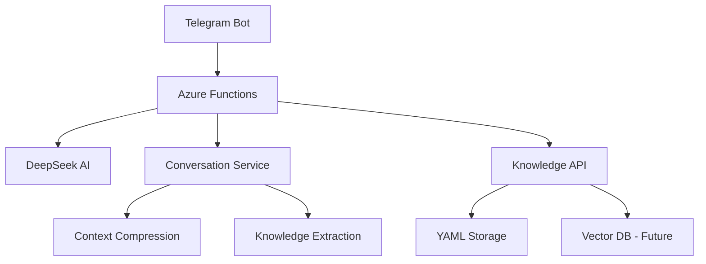

# Adaptive AI Assistant

> Universal AI platform for creating personal assistants with automatic learning from conversations

[](https://github.com/yourusername/adaptive-ai-assistant)
[](https://dotnet.microsoft.com/)
[](https://azure.microsoft.com/services/functions/)
[](https://deepseek.com/)

## 🎯 What is this

**Adaptive AI Assistant** is a platform for creating smart assistants that:

- **Learn from conversations** — each dialog makes the system smarter
- **Automatically update knowledge** — suggest saving important information
- **Work with any data** — projects, clients, tasks, processes
- **Adapt to users** — understand context and preferences

**Problem:** Corporate knowledge is scattered across files, chats, emails. Finding information takes hours.

**Solution:** AI assistant that remembers everything, understands context, and responds in natural language.

## 🏗️ Architecture



### Components:

- **Telegram Bot** — user interface
- **Azure Functions** — serverless request orchestration
- **DeepSeek AI** — conversation analysis and response generation
- **Conversation Service** — intelligent context management with compression
- **Knowledge API** — data and file management
- **YAML + Git** — structured knowledge storage

## 🚀 Quick Start

### Prerequisites:
- .NET 8.0 SDK
- Azure Functions Core Tools
- DeepSeek API key
- Telegram Bot token

### Installation:

1. **Clone repository:**
   ```bash
   git clone https://github.com/yourusername/adaptive-ai-assistant.git
   cd adaptive-ai-assistant/AdaptiveAIBot/AdaptiveAIBot/AdaptiveAIBot
   ```

2. **Configure settings:**
   ```bash
   # Create local.settings.json (copy from template)
   cp local.settings.json.template local.settings.json
   
   # Add your API keys
   nano local.settings.json
   ```

3. **Install dependencies:**
   ```bash
   dotnet restore
   ```

4. **Build project:**
   ```bash
   dotnet build
   ```

5. **Run locally:**
   ```bash
   func start --port 7064
   ```

### Configuration:

Create `local.settings.json`:
```json
{
  "IsEncrypted": false,
  "Values": {
    "AzureWebJobsStorage": "UseDevelopmentStorage=true",
    "FUNCTIONS_WORKER_RUNTIME": "dotnet-isolated",
    "DEEPSEEK_API_KEY": "your_deepseek_api_key",
    "TELEGRAM_BOT_TOKEN": "your_telegram_bot_token"
  }
}
```

## 💡 Usage Examples

### Corporate Assistant:
```
👤 User: "What's the status of Priority ERP project?"
🤖 Assistant: "Project is on track, 78% tasks completed. Last update: API integration finished yesterday."

🤖 Assistant: "Save this update to knowledge base?"
👤 User: [✅ Yes]
🤖 Assistant: "✅ Updated projects.yaml"
```

### Meeting Management:
```
👤 User: "What did we decide at the planning meeting on August 5th?"
🤖 Assistant: "Main decisions: postpone release by one week, add API testing, assign Alex as integration lead."
```

## 🧠 AI Memory Innovation

### "AI Prompt ZIP" Technology:

**Problem:** Context growth = exponential costs
- Message 1-20: 200-500 tokens
- Message 50+: 2000+ tokens  
- Each new message costs more than previous

**Solution:** Multi-layer intelligent compression
- **Level 1:** Active memory (last 20 messages)
- **Level 2:** AI-compressed summaries (10:1 ratio)
- **Level 3:** Persistent knowledge database
- **Level 4:** Long-term behavioral insights

**Benefits:**
- 90% cost reduction through compression
- Infinite conversation memory
- Personalized AI responses
- Learning and evolving assistant

## 📁 Project Structure

```
AdaptiveAIBot/
├── Models/
│   ├── ConversationModels.cs    # Context and memory structures
│   ├── DeepSeekModels.cs        # AI API integration
│   └── TelegramModels.cs        # Telegram webhook models
├── Services/
│   ├── ConversationService.cs   # Smart context compression
│   ├── DeepSeekService.cs       # AI integration
│   └── TelegramService.cs       # Telegram API
├── Functions/
│   └── TelegramWebhookFunction.cs # Azure Function entry point
├── Program.cs                   # DI configuration
└── host.json                   # Azure Functions settings
```

## 🔧 Key Features

### Smart Context Compression:
```csharp
// Automatic compression when context > 20 messages
if (context.Messages.Count >= MAX_MESSAGES_BEFORE_COMPRESSION)
{
    await CompressConversationAsync(userId);
}

// AI creates intelligent summaries
var summary = CreateConversationSummary(messagesToCompress);
```

### Importance Detection:
```csharp
// Analyze message importance using keywords, dates, metrics
var messageAnalysis = await AnalyzeMessageAsync(userMessage);
if (messageAnalysis.ImportanceScore > 0.3)
{
    // Suggest knowledge base update
}
```

### Cost Optimization:
- DeepSeek API: $0.27/$1.10 per 1M tokens
- ~18,000 messages for $5 USD
- Context compression reduces costs by 90%

## 🛣️ Roadmap

### ✅ Phase 1: MVP (Current)
- [x] Telegram bot with basic functionality
- [x] Azure Functions processing
- [x] DeepSeek AI integration
- [x] Smart context compression
- [x] In-memory conversation storage

### 🔄 Phase 2: Intelligence (Next)
- [ ] Vector database (Weaviate) integration
- [ ] Advanced knowledge extraction
- [ ] YAML knowledge base management
- [ ] Web interface for knowledge management

### 🚀 Phase 3: Platform (Future)
- [ ] Multi-tenant support
- [ ] API for external integrations
- [ ] Enterprise security features
- [ ] Advanced analytics and insights

## 📊 Technical Stack

- **Backend:** .NET 8, Azure Functions (Serverless)
- **AI:** DeepSeek API (primary), Claude (reserve)
- **Storage:** In-memory (MVP) → Redis (Production)
- **Future:** Weaviate Vector Database
- **Infrastructure:** Azure (Israel Central region)
- **Cost Protection:** Budget limits + alerts

## 🔐 Security

- User authentication via Telegram ID
- Whitelist-based access control
- API key encryption and secure storage
- Budget protection with automatic alerts
- Git-based version control for knowledge

## 📈 Success Metrics

- **Information retrieval time:** From hours to minutes
- **Response quality:** >90% relevant results
- **Knowledge growth:** 20+ auto-captured facts per week
- **User satisfaction:** >8/10 rating
- **Cost efficiency:** 90% reduction vs. traditional context management

## 🤝 Contributing

This project is in active development. We welcome:

- 🐛 Bug reports and improvement suggestions
- 💡 New feature ideas
- 📖 Documentation improvements
- 🔧 Pull requests with fixes

See [CONTRIBUTING.md](CONTRIBUTING.md) for guidelines.

## 📄 License

MIT License - see [LICENSE](LICENSE) file for details

## 📞 Contact

- **Creator:** Yuri Katz
- **Email:** yurakatz@gmail.com
- **Location:** Israel
- **Specialization:** Enterprise AI, ERP Systems, Cybersecurity

---

**Project Status:** 🟢 MVP Ready | First production deployment expected September 2025

**Innovation Highlight:** World's first AI assistant with intelligent infinite memory through context compression technology.